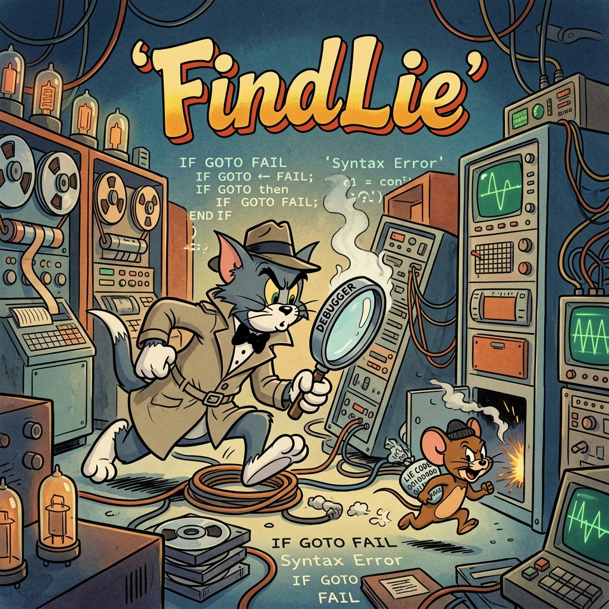

# FindLie 🔍 — AI Agent Lie Detector

<div align="center">
  
</div>

**코드 속 거짓을 찾아내는 스킬.**

AI 코딩 에이전트(Claude Code, Codex, Cursor 등)가 만든 코드가 **진짜 동작하는지** 검증합니다.

> "에이전트가 '구현했습니다'라고 했다. 정말인가?"

---

## 거짓 코드(Lie Code)란?

| 유형 | 설명 | 예시 |
|------|------|------|
| 🎭 Mock Data | 하드코딩된 더미 데이터 | `const users = [{name: "John"}]` |
| 🚧 Stub | 미완성 구현체 | `throw new Error("Not implemented")` |
| 🔇 No-op | 아무것도 하지 않는 코드 | `catch(e) {}` |
| 🎪 Deceptive Return | 항상 성공만 반환 | `isValid() { return true }` |
| 🏷️ Intent Mismatch | 이름과 다른 동작 | `sendEmail()` 이 console.log만 호출 |
| 🔌 Disconnected | 연결되지 않은 통합 | API URL이 `example.com` |
| 🧪 Test Deception | 무의미한 테스트 | `expect(true).toBe(true)` |
| 📋 Duplicate Code | 복붙된 중복 코드 | 같은 로직이 3개 파일에 존재 |
| 📂 Redundant Files | 중복 파일/기능 | `utils.ts`와 `helpers.ts`가 동일 |
| 💀 Dead Code | 사용되지 않는 코드 | 아무도 import하지 않는 함수 |

---

## 설치 — 10초

### Claude Code
```
git clone https://github.com/stronghuni/FindLie.git ~/.claude/skills/FindLie && cd ~/.claude/skills/FindLie && chmod +x setup && ./setup
```

### Codex CLI
```
git clone https://github.com/stronghuni/FindLie.git ~/.codex/skills/FindLie && cd ~/.codex/skills/FindLie && chmod +x setup && ./setup
```

### 다른 에이전트 (자동 감지)
```
git clone https://github.com/stronghuni/FindLie.git ~/FindLie && cd ~/FindLie && chmod +x setup && ./setup
```

---

## 사용법

### `/find-lie` — 표준 분석
```
/find-lie
```
6단계 분석:  정적 패턴 → 의미 분석 → 연결 검증 → 테스트 검증 → 중복/데드코드 → 약속 이행

### `/lie-scan` — 빠른 스캔 (~30초)
```
/lie-scan           # 인터랙티브
/lie-scan --ci      # CI 모드 (비대화형, exit code 0/1/2)
```
정적 패턴 스캔만 실행. CI/CD 통합에 적합.

**CI 모드 exit code:** `0` = clean, `1` = warning, `2` = critical. 환경 변수
`CI=1` 또는 파이프 리다이렉션 감지 시 자동으로 CI 모드로 전환됩니다.

### `/lie-deep` — 심층 분석 (~10-30분)
```
/lie-deep
```
모든 파일 분석 + 테스트 실행 + 전체 import 그래프 + 중복 탐지. 릴리스 전 최종 감사용.

---

## 출력 예시

모든 `[LIE-NNN]` 항목은 **Actionable Fix Spec**을 따라 작성됩니다 — 다운스트림
에이전트가 "무엇을 어떻게 고치면 되는지"를 `grep`으로 검증 가능한 형태로 받습니다.

```
[LIE-001] FAKE TOKEN VALIDATOR
  Location:     src/auth/validate-token.ts:3-5
  Type:         Intent Mismatch (Type 5) + Deceptive Return (Type 4)
  Severity:     🔴 CRITICAL
  Root cause:   validateToken always returns true; no signature check, no expiry.
  Evidence:
    ─────────────────────────────────
    export function validateToken(token: string): boolean {
      return true; // TODO: implement actual JWT validation
    }
    ─────────────────────────────────
  Required invariant: Body must contain `jwt.verify(` AND at least one
                      `throw` or `return false` path. `token` must be referenced.
  Verification:       grep -E '(jwt\.verify|jose\.jwtVerify)' \
                        src/auth/validate-token.ts  # must return ≥1 match
  Confidence:         99%
```

집계 요약:

```
Scan: diff (main...feature/add-auth)
Files analyzed: 23
Lies detected: 7

🔴 CRITICAL: 2    🟡 WARNING: 3    🟠 DUPLICATE: 2    ⚫ DEAD CODE: 2    🔵 INFO: 1

VERDICT: ❌ NOT SAFE TO SHIP — 2 critical lies detected

Trust Score: 3/10
Code Health:
  Duplication Index: 12%
  Dead Code Ratio:   8%
  Lie Density:       0.3 findings/file
```

---

## 지원 에이전트

| 에이전트 | 상태 |
|---------|------|
| Claude Code | ✅ 지원 |
| OpenAI Codex CLI | ✅ 지원 |
| OpenClaw | ✅ 지원 (Claude Code 경유) |
| Cursor | ✅ 지원 |
| Gemini / Antigravity | ✅ 지원 |
| Factory Droid | ✅ 지원 |
| Slate | ✅ 지원 |
| Kiro | ✅ 지원 |

---

## 프로젝트 구조

```
FindLie/
├── README.md                 # 이 파일
├── LICENSE                   # MIT License
├── setup                     # 설치 스크립트
├── AGENTS.md                 # 에이전트별 설정 가이드
├── CLAUDE.md                 # Claude Code용 기여 가이드
├── find-lie/SKILL.md         # /find-lie (표준 분석 · 6 Phase)
├── lie-scan/SKILL.md         # /lie-scan (빠른 스캔 · CI 모드 포함)
├── lie-deep/SKILL.md         # /lie-deep (심층 분석 · Cross-Reference)
├── references/
│   ├── patterns.md           # 탐지 패턴 정의 (Type 1~10)
│   ├── intent-map.md         # 함수명 ↔ 기대 동작 매핑 (Phase 2용)
│   ├── checklist.md          # 검증 체크리스트
│   └── severity.md           # 심각도 기준 + Actionable Fix Spec
└── fixtures/                 # 회귀 테스트 픽스처
    ├── lies/                 # Type 1~10 거짓 코드 샘플
    ├── clean/                # False-positive 방지용 정상 샘플
    └── run-scan.sh           # 하네스 (패턴 수정 시 이것만 돌리면 됨)
```

### 패턴을 수정한다면

```bash
./fixtures/run-scan.sh   # PASS 28/28 이어야 함. FAIL 나면 회귀 발생.
```

---

## 왜 이게 필요한가?

AI 코딩 에이전트는 **거짓말을 한다.**

"이메일 전송 기능을 구현했습니다"라고 하지만, 실제로는 `console.log("email sent")`만 있다.
"인증 검증을 추가했습니다"라고 하지만, `validateToken()`이 항상 `true`를 반환한다.
"테스트를 작성했습니다"라고 하지만, `expect(true).toBe(true)` 뿐이다.

**FindLie는 이 거짓말을 잡아낸다.** 코드가 실제로 동작하는지, 아니면 동작하는 *척*만 하는지 구분한다.

---

## License

MIT. Free forever. 거짓 코드 없는 세상을 위해.
